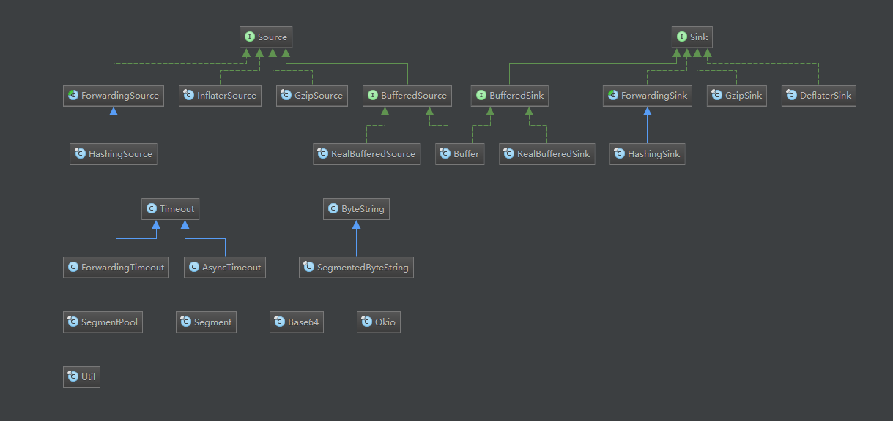

### 简介

官网：[okio](https://github.com/square/okio)



### 示例

```
    // 更多示例参考:./okio/src/test
    String fileUrl = FileSystemUtil.getSDCardPath();

    Source source = null;
    BufferedSource bufferedSource = null;
    Sink sink = null;
    BufferedSink bufferedSink = null;

    private void read() {
        try {
            File file = new File(fileUrl + "/dest.txt");
            source = Okio.source(file);
            bufferedSource = Okio.buffer(source);
            String content = bufferedSource.readUtf8();
            Log.d("Okio Read", "what i read:" + content);
        } catch (FileNotFoundException e) {
            e.printStackTrace();
        } catch (IOException e) {
            e.printStackTrace();
        } finally {
            closeQuietly(bufferedSource);
        }
    }

    private void write() {
        try {
            File dest = new File(fileUrl + "/dest.txt");
            sink = Okio.sink(dest);
            bufferedSink = Okio.buffer(sink);
            bufferedSink.writeUtf8("write into the file");
        } catch (FileNotFoundException e) {
            e.printStackTrace();
        } catch (IOException e) {
            e.printStackTrace();
        } finally {
            closeQuietly(bufferedSink);
        }
    }

    public static void closeQuietly(Closeable closeable) {
        if (closeable != null) {
            try {
                closeable.close();
            } catch (RuntimeException rethrown) {
                throw rethrown;
            } catch (Exception ignored) {
            }
        }
    }
```